  <picture>
    <source media="(prefers-color-scheme: dark)" srcset="./banner.svg" />
    <source media="(prefers-color-scheme: light)" srcset="./banner-light.svg" />
    
  </picture>

<h1 align="center">👋 Hi, I'm Abhishek Kumar</h1>
<h3 align="center">Full Stack Developer • Code. Coffee. Repeat.</h3>

  

  
  

## 🚀 About Me
- 💻 I build modern full-stack web applications.
- 🌱 Always learning new technologies and improving problem-solving.
- ⚡ Motto: **Learn → Build → Repeat**

## 🧠 Tech Stack
### Languages
JavaScript · TypeScript · Python · C · C++ · Java · SQL

### Frameworks & Tools
React.js · Node.js · Express.js · PostgreSQL · MongoDB · Git · GitHub · Postman · Vercel · Render
