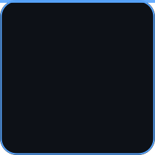

<!-- Wave banner -->

 

## 💫 About Me

- 🌱 I'm currently learning full stack development
- 💻 I love building things with **JavaScript, Python & the web**
- 🎯 Focusing on leveling up my dev skills, one project at a time
- 📫 Always open to connecting — reach out below!

 

## 🌐 Connect With Me

 

## 💻 Tech Stack

 

## 📊 GitHub Stats

 

## 🐍 Contribution Snake

 

## 🧊 3D Contribution Calendar

 

## 🏆 GitHub Trophies

 

### ✍️ Random Dev Quote

 

